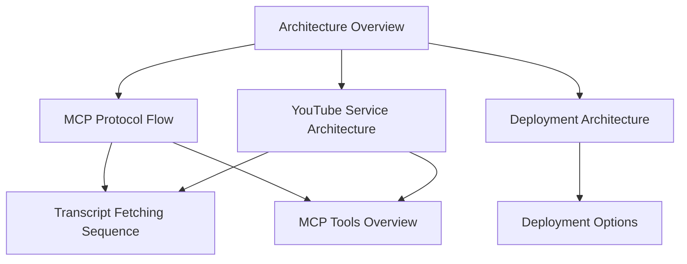

# YouTube MCP Server - Architecture Diagrams

This directory contains comprehensive PlantUML diagrams documenting the architecture of the YouTube MCP Server. These diagrams provide visual documentation of the system's design, components, and interactions.

## 📋 Diagram Overview

### 1. [Architecture Overview](architecture-overview.puml)
**Purpose**: High-level system architecture showing all layers and components
- **Layers**: Client, Entry Point, Protocol, Business Logic, Infrastructure
- **Components**: MCP Server, YouTube Service, Cache, Health Checker
- **External Services**: YouTube API, Proxy Servers
- **Key Features**: Layered architecture, dependency injection, middleware pipeline

### 2. [MCP Protocol Flow](mcp-protocol-flow.puml)
**Purpose**: Detailed flow of MCP protocol requests and responses
- **Initialization**: Server capabilities and tool discovery
- **Tool Execution**: Request validation, routing, and response handling
- **Error Handling**: JSON-RPC 2.0 compliant error responses
- **Caching**: Cache hit/miss scenarios and storage

### 3. [YouTube Service Architecture](youtube-service-architecture.puml)
**Purpose**: Internal architecture of the YouTube service component
- **Core Classes**: Service, RateLimitState, ProxyManager, CompositeFetcher
- **Data Models**: TranscriptResponse, TranscriptSegment, TranscriptMetadata
- **Patterns**: Composite pattern for fetchers, adaptive rate limiting
- **Dependencies**: Cache interface, YouTube API integration

### 4. [Deployment Architecture](deployment-architecture.puml)
**Purpose**: Deployment and infrastructure setup
- **Environments**: Development and Production
- **Docker**: Container configuration and profiles
- **Services**: Redis, Prometheus, Grafana (optional)
- **Configuration**: Environment variables and port mapping
- **Monitoring**: Health checks and metrics collection

### 5. [Transcript Fetching Sequence](transcript-fetching-sequence.puml)
**Purpose**: Detailed sequence of transcript fetching process
- **Rate Limiting**: Adaptive rate limiting with exponential backoff
- **Caching**: Cache key generation and TTL management
- **Proxy Rotation**: Proxy selection and rotation
- **YouTube Integration**: HTML parsing and XML extraction
- **Error Handling**: Network, parse, and rate limit errors

### 6. [MCP Tools Overview](mcp-tools-overview.puml)
**Purpose**: MCP tools and their relationships
- **Tools**: 5 MCP tools with their parameters and capabilities
- **Data Models**: Response types and format options
- **Dependencies**: YouTube service and cache integration
- **Features**: Batch processing, translation, formatting

## 🎯 Key Architectural Patterns

### Layered Architecture
The system follows a clean layered architecture:
1. **Entry Point Layer**: Configuration and middleware setup
2. **Protocol Layer**: MCP protocol implementation
3. **Business Logic Layer**: YouTube service with rate limiting
4. **Infrastructure Layer**: Caching, health checks, configuration

### Design Patterns
- **Composite Pattern**: Multiple transcript fetchers with fallback
- **Strategy Pattern**: Different rate limiting strategies
- **Adapter Pattern**: Cache abstraction for memory/Redis
- **Observer Pattern**: Health check monitoring

### Performance Features
- **Adaptive Rate Limiting**: Exponential backoff on failures
- **Proxy Rotation**: Distributed requests to avoid limits
- **Multi-level Caching**: Memory and Redis cache support
- **Concurrent Processing**: Batch operations with goroutines

## 🔧 Technical Implementation

### MCP Protocol Compliance
- **JSON-RPC 2.0**: Full protocol implementation
- **Tool Registration**: Schema validation for all tools
- **Error Handling**: Standard error codes and messages
- **Request Routing**: Efficient tool-to-handler mapping

### YouTube Integration
- **HTML Parsing**: Extract `ytInitialPlayerResponse` from pages
- **Caption Selection**: Language preference with fallback
- **XML Parsing**: Handle both `<transcript>` and `<timedtext>` formats
- **Metadata Extraction**: Video information and statistics

### Caching Strategy
- **Cache Keys**: Video ID + language preferences
- **TTL Management**: Different TTLs for different data types
- **Size Limits**: Memory and size-based eviction
- **Compression**: Optional response compression

## 📊 Monitoring and Health

### Health Checks
- **Cache Connectivity**: Set/get operations
- **YouTube Service**: Language list fetching
- **Network Connectivity**: HEAD requests to YouTube
- **Parallel Execution**: Concurrent health checks

### Metrics Collection
- **Request Statistics**: Tool execution counts and timing
- **Rate Limiting**: Success/failure rates
- **Cache Performance**: Hit/miss ratios
- **Error Tracking**: Error types and frequencies

## 🚀 Deployment Options

### Development
- **Local Execution**: `go run` with hot reload
- **Testing**: Comprehensive unit and integration tests
- **Debugging**: Structured logging with debug levels

### Production
- **Docker**: Multi-stage builds with security
- **Docker Compose**: Three deployment profiles
- **Monitoring**: Optional Prometheus/Grafana stack
- **Scaling**: Horizontal scaling with load balancers

## 📝 Usage Examples

### Viewing Diagrams
```bash
# Install PlantUML
npm install -g @plantuml/plantuml

# Generate PNG images
plantuml docs/*.puml

# Generate SVG images
plantuml -tsvg docs/*.puml
```

### Online Viewing
- Copy PlantUML content to [PlantUML Online Server](http://www.plantuml.com/plantuml/uml/)
- Use VS Code PlantUML extension for live preview
- Generate documentation with PlantUML tools

## 🔍 Diagram Relationships



## 📚 Additional Documentation

- [Development Guide](../development-guide.md): Setup and development workflow
- [Implementation Status](../implementation-status.md): Feature completion status
- [Requirements](../requirements.md): Original requirements and specifications
- [MCP Client Setup](../mcp-client-setup.md): Client configuration guide

## 🤝 Contributing

When modifying the architecture:
1. Update relevant diagrams to reflect changes
2. Maintain consistency across all diagrams
3. Update this README with new diagrams
4. Test diagram generation with PlantUML tools

---

*These diagrams provide comprehensive visual documentation of the YouTube MCP Server architecture. They serve as both design documentation and implementation guides for developers working with the system.*
